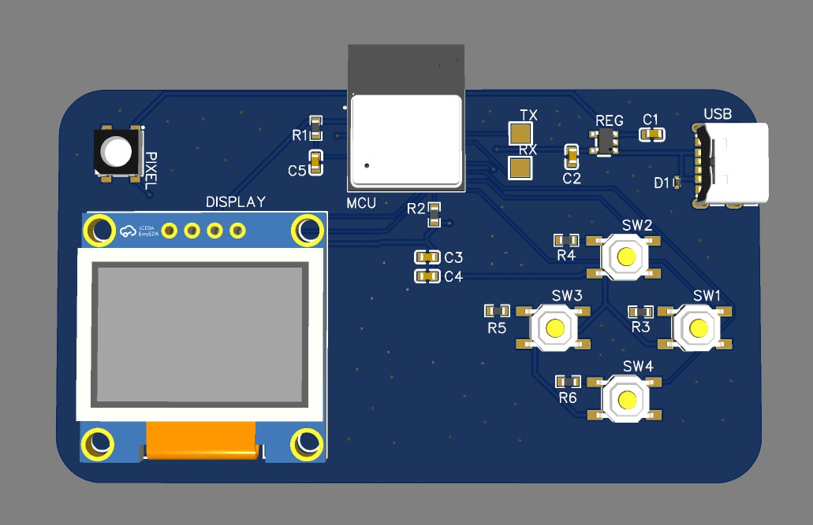

# Morse Gadget

An overly-complicated Valentine's day gift (worth it).

**SPECS:**
- RISC-V ESP32 C3 as the brains of the operation
- SSD1306 equivalent display
- USB-C power (no power-delivery)
- WS2812 Neopixel

<!--  -->

## A small inscription

This project was made for my girlfriend as a Valentine's day gift, thus it only feels due mentioning her as the sole purpose and motivation behind this project. It took me quite a bit of time and dedication and I wouldn't have done it for anyone other than her 💜

## Demo (incomplete)

Demo video of the device working

## What does it do

It's a pocket-size device that uses **ESP-NOW** to communicate small text messages without the need of an internet connection.

Due to the lack of space to insert a keyboard (who would have guessed) the letters are inputted through **morse**!

## Technologies used

The project is based on [**embassy**](docs.rs/embassy). Not using the IDF was a deliberate choice as it concedes me more flexibility on how i poll devices for updates.

Everything is up-to-date with the latest major release of `embedded-hal`.

## Mistakes

Oh god, well, a lot actually, ranging from the stupidest up to the funniest.

**PROBLEMS**:

1) I've got the date wrong. I am not joking, I thought Valentine's day was on the 15th and not the 14th. This has fortunately become an inside joke

2) I haven't exposed **GPIO9** thus making it IMPOSSIBLE to enter the bootloader and re-program the device.

**FIXES**:

1) The only fix was to laugh about it plenty

2) I had to **REMOVE THE RF SHIELD** and bridge GPIO9 with a jumper for the first upload. I then put a snippet in my code that allows me to enter download mode by pressing SW4 upon startup.

## Things I'd improve

1) First of all, I'd actually spend the time to design the UART circuit to program it through the USB, it would have been just much cooler and would have allowed my girlfriend, if she ever got interested in doing this kind of things in the future, to reprogram freely the device with just a USB cable

2) I would have also put the USB-C power delivery circuit to make it work with USB-C <-> USB-C cables. Right now it only works with USB-A -> USB-C cables

3) Better buttons. These buttons are a bit hard to press unless you do it with your fingernail. They're not really suited for pressing them with the soft side of your fingertips.

4) 3D printed case

5) A small battery: this device doesn't actually consume a lot (except for the Neopixel which consumes almost 5W at peak power!!) so it would only make sense to implement a battery circuit to make it fully handheld